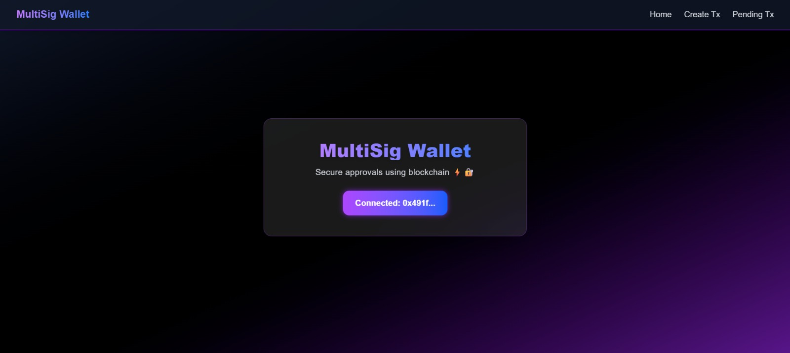
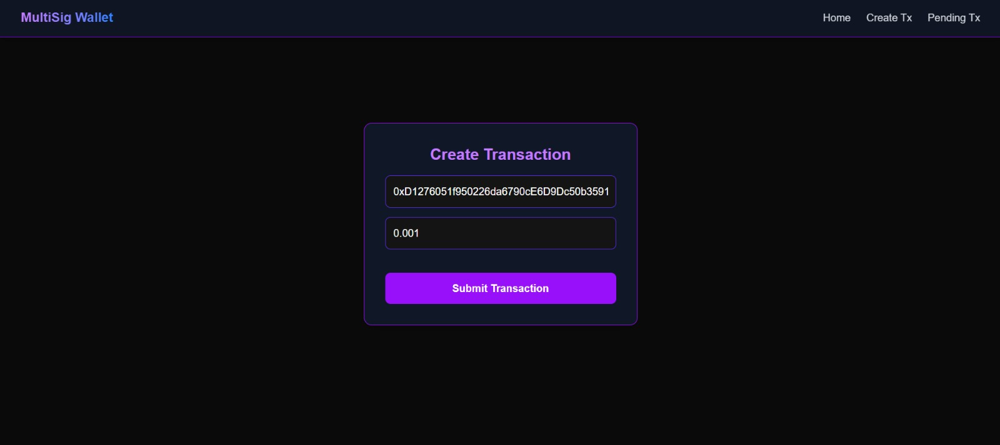
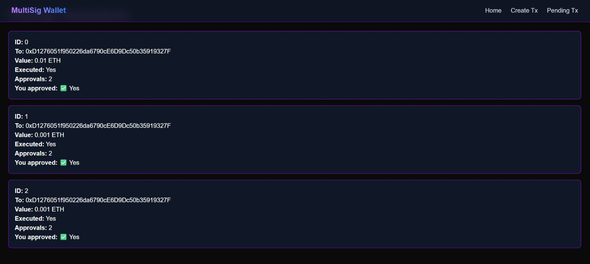

#  MultiSig Wallet DApp

A fully functional **Multi-Signature Ethereum Wallet DApp** built using  
**Solidity, Next.js, and Ethers.js**, deployed on the **Sepolia Testnet**.

##  Live Demo
 https://multisig-wallet-dapp-live.vercel.app/

##  Features
- Create ETH transactions from a multisig wallet
- Requires approval from multiple owners
- Prevents duplicate approvals
- Executes transactions only after threshold approvals
- Shows real-time transaction status (Pending / Executed)

##  Tech Stack
- **Solidity** – Smart contract
- **Hardhat** – Compilation & deployment
- **Next.js (App Router)** – Frontend
- **Ethers.js v6** – Blockchain interaction
- **MetaMask** – Wallet connection
- **Vercel** – Frontend hosting

##  Smart Contract Overview
- Network: **Sepolia Testnet**
- Owners: **2**
- Required approvals: **2**
- Secure execution logic
- Owner-only actions enforced

##  How It Works

This is a **2-of-N Multi-Signature Wallet**, where a transaction must be approved by multiple owners before execution.

###  Workflow

1. **Create Transaction**
   - Any owner can create a transaction by specifying:
     - Recipient address
     - Amount of ETH
   - The transaction is stored on-chain and marked as *pending*.

2. **Approve Transaction**
   - Other wallet owners can approve the pending transaction.
   - Each owner can approve **only once**.
   - Approval count increases with each valid approval.

3. **Execute Transaction**
   - Once the required number of approvals is reached:
     - Any owner can execute the transaction.
     - ETH is transferred from the multisig wallet.
     - Transaction is marked as *executed*.

4. **Security Guarantees**
   - Transactions cannot be executed twice.
   - Non-owners cannot approve or execute transactions.
   - Full transparency via on-chain state and UI.

##  Project Structure
- contracts/ → Solidity smart contracts
- frontend/ → Next.js frontend
- scripts/ → Deployment scripts

## Screenshots

### Home

### Create Transaction

### Pending Transactions

